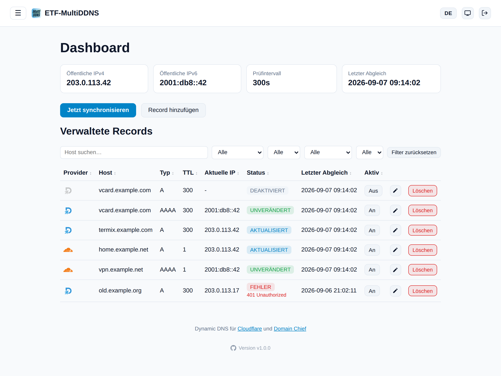

[English](README.md) | **Deutsch**

# ETF-MultiDDNS

Ein kleiner Docker-Container, der A/AAAA-Records bei [Domain Chief](https://domain.chief.app)
automatisch auf die aktuelle öffentliche IP-Adresse aktualisiert - ähnlich wie
[cloudflare-ddns](https://github.com/timothymiller/cloudflare-ddns), nur für Domain Chief statt Cloudflare.

Enthält:

- einen Hintergrund-Sync-Loop, der die öffentliche IPv4/IPv6-Adresse prüft und bei Domain Chief
  gehostete DNS-Records automatisch **anlegt** (falls sie noch nicht existieren) oder **aktualisiert**
  (falls sich die IP geändert hat)
- ein Web-UI zum Anlegen, Aktivieren/Deaktivieren und **Löschen** von Records, Einsehen des Status
  und der Logs
- ein optionales CLI (`docker exec`) für die Verwaltung per Skript/SSH



## Voraussetzungen

- Die betroffene(n) Domain(s) müssen bei Domain Chief **Hosted DNS** verwenden (d.h. die Nameserver
  von Domain Chief sind aktiv). Ohne Hosted DNS kann die API keine Records verwalten.
- Ein Domain Chief **Personal Access Token** (empfohlen für den privaten Gebrauch) oder ein
  **Team Access Token**.

### Token erstellen

1. Personal Access Token: <https://domain.chief.app/api/token/create>
2. Benötigte Scopes: `domainchief:dns:read`, `domainchief:dns:write` und `domainchief:domains:read`
   (letzterer nur, damit das Web-UI beim Anlegen eines Records eine Liste deiner Domains vorschlagen kann).
3. Falls dein Account mehrere Teams hat und nicht das Standard-Team verwendet werden soll: die Team-ID
   zusätzlich im Web-UI bzw. per `DOMAINCHIEF_TEAM_ID` hinterlegen. Alternativ direkt ein
   **Team Access Token** (`ctt_...`) verwenden - das ist automatisch auf ein Team festgelegt.

## Start mit Docker Compose (fertiges Image)

```bash
cp .env.example .env   # optional, Token kann auch im Web-UI gesetzt werden
# in docker-compose.yml den Image-Namen einmal anpassen (Benutzername klein-
# geschrieben!), dann:
docker compose up -d
```

Danach ist das Web-UI unter `http://<host>:8080` erreichbar. Wenn kein Token per Umgebungsvariable
gesetzt wurde, kannst du es dort unter **Einstellungen** eintragen - inklusive einem "Verbindung testen"-Button.
Optional ist es unter **Einstellungen -> HTTPS** (siehe unten) zusätzlich verschlüsselt über
`https://<host>:8443` erreichbar - beide Ports funktionieren parallel.

Die Konfiguration (Token falls im UI gesetzt, Team-ID, Records, Status) liegt in `./config/config.json`
und überlebt Container-Neustarts, da der Ordner als Volume gemountet ist.

## Start mit reinem `docker run` (fertiges Image, kein Build nötig)

```bash
docker run -d \
  --name etf-multiddns \
  --restart unless-stopped \
  -p 8080:8080 \
  -p 8443:8443 \
  -e DOMAINCHIEF_API_TOKEN=ctp_dein_token \
  -e CHECK_INTERVAL=300 \
  -v $(pwd)/config:/config \
  ghcr.io/<dein-github-name-kleingeschrieben>/etf-multiddns:latest
```

(Die Zeile `-p 8443:8443` weglassen, falls kein HTTPS aktiviert werden soll und der Port nicht
exponiert werden soll.)

## Records verwalten

### Über das Web-UI

- **Dashboard** (`/`): zeigt die aktuell erkannte öffentliche IPv4/IPv6, den Zeitpunkt des letzten
  Abgleichs und den Status jedes verwalteten Records (unverändert / erstellt / aktualisiert / Fehler).
  Ein Button erlaubt das sofortige Anstoßen eines Abgleichs, ohne auf das Intervall zu warten. Über den
  Button "Record hinzufügen" gelangt man zum Anlegen-/Bearbeiten-Formular (kein eigener Menüpunkt mehr);
  in der Record-Liste öffnet das Stift-Symbol dasselbe Formular im Bearbeitungsmodus.
- **Record hinzufügen/bearbeiten** (`/records/new` bzw. `/records/<id>/edit`, ein gemeinsames Formular):
  Domain, Subdomain (leer = Root-Domain, z.B. nur `beispiel.at`), Typ (A/AAAA), TTL und Kommentar angeben.
  Beim Anlegen: existiert bei Domain Chief schon ein passender Record, wird dieser beim nächsten Abgleich
  übernommen (nicht doppelt angelegt). Beim Bearbeiten ist nur die Domain fix (dafür den Record löschen
  und neu anlegen) - Subdomain, Typ, TTL und Kommentar lassen sich ändern. Wird dabei Subdomain oder Typ
  geändert, legt der nächste Abgleich automatisch einen neuen DNS-Record bei Domain Chief an und entfernt
  den alten; reine TTL-/Kommentar-Änderungen werden ebenfalls erst beim nächsten Abgleich übernommen.
- **Löschen**: Der Papierkorb-Button in der Record-Liste löscht den Record sowohl aus der lokalen
  Konfiguration als auch direkt bei Domain Chief über die API.
- **Einstellungen** (`/settings`): API-Token, Team-ID, Prüfintervall, Zeitzone und Datum-/Zeitformat
  (für die Anzeige von Zeitstempeln) sowie die Web-UI-Zugangsdaten (Benutzername/Passwort).
- **Logs** (`/logs`): letzte Logzeilen des Sync-Loops.

### Login, Darstellung & Sprache

- **Login:** Beim allerersten Aufruf des Web-UI führt ein Ersteinrichtungs-Assistent (`/setup`) durch
  das Anlegen von Benutzername und Passwort. Danach ist jeder Aufruf über `/login` geschützt (Session-
  Cookie, 30 Tage gültig). Über den Button "Abmelden" oben rechts kann man sich jederzeit ausloggen,
  die Zugangsdaten lassen sich unter **Einstellungen** ändern.
  Alternativ können Benutzername/Passwort fix über die Umgebungsvariablen `WEBUI_USERNAME` /
  `WEBUI_PASSWORD` vorgegeben werden (siehe `.env.example` bzw. `docker-compose.yml`) - dann entfällt
  der Ersteinrichtungs-Assistent und die Felder in den Einstellungen sind deaktiviert.
- **Darstellung:** Oben rechts lässt sich zwischen Hell, Dunkel und System (folgt der Betriebssystem-
  Einstellung) wählen. Die Wahl wird im Browser gespeichert (`localStorage`) und gilt nur lokal für
  dieses Gerät/diesen Browser.
- **Sprache:** Die Oberfläche ist auf Deutsch und Englisch verfügbar, umschaltbar über "DE"/"EN" oben
  rechts (wird per Cookie gespeichert).
- **Menü:** Die Navigation (Dashboard, Record hinzufügen, Einstellungen, Logs) liegt hinter dem
  Burger-Symbol (☰) oben links und klappt als Overlay über den Inhalt. Über das Stecknadel-Symbol
  im Menü lässt es sich fixieren - dann bleibt es dauerhaft sichtbar und der Inhalt rückt entsprechend
  nach rechts. Die Fixierung wird im Browser gespeichert (`localStorage`) und gilt nur lokal für
  dieses Gerät/diesen Browser.
- **Zeitzone & Datum-/Zeitformat:** Standardmäßig läuft der Container in UTC. Unter **Einstellungen**
  lässt sich eine echte IANA-Zeitzone (z.B. `Europe/Vienna`) sowie das Anzeigeformat für Zeitstempel
  wählen - wirkt sich auf die Logs (`/logs`) und die im Dashboard angezeigten Zeitpunkte
  (z.B. "Letzter Abgleich") aus. Änderungen wirken sofort, ohne Container-Neustart. Alternativ per
  `TZ`-Umgebungsvariable vorgeben (siehe `.env.example`) - dann hat sie Vorrang und das Feld in den
  Einstellungen ist deaktiviert.

### HTTPS / Sichere Verbindung

Standardmäßig wird das Web-UI nur über einfaches HTTP (Port 8080) ausgeliefert. Unter
**Einstellungen -> HTTPS** lässt sich zusätzlich eine verschlüsselte Verbindung über Port 8443
aktivieren (beide Ports laufen dann parallel weiter - HTTP wird nicht abgeschaltet) -
`https://<host>:8443`. Zwei Zertifikatsquellen stehen zur Auswahl:

- **Selbstsigniert (Standard, sobald aktiviert):** wird automatisch erzeugt, keine Einrichtung nötig.
  Da es nicht von einer vertrauenswürdigen Zertifizierungsstelle ausgestellt ist, zeigt der Browser
  beim ersten Aufruf der HTTPS-URL eine Sicherheitswarnung an - das ist normal und kann bestätigt/als
  Ausnahme hinzugefügt werden. Optional lässt sich in den Einstellungen ein Hostname oder eine IP (z.B.
  die eigene DDNS-Domain) eintragen, der dann als Zertifikatsname (CN/SAN) verwendet wird, statt eines
  generischen `localhost`-Zertifikats. Ein "Zertifikat neu erzeugen"-Button steht bereit, falls einmal
  ein frisches benötigt wird.
- **Eigenes Zertifikat:** eigenes Zertifikat + privaten Schlüssel importieren (PEM-Format,
  unverschlüsselt, z.B. von Let's Encrypt oder einer internen/Firmen-CA ausgestellt), um die
  Browser-Warnung ganz zu vermeiden. Nach dem Hochladen wird die Zertifikatsquelle automatisch auf
  "Eigenes Zertifikat" umgestellt; es lässt sich jederzeit wieder entfernen (zurück zum
  selbstsignierten).

Sowohl Zertifikat als auch privater Schlüssel liegen in `config/certs/` (auf demselben persistenten
Volume wie `config/config.json`), und jede Änderung wirkt sofort - kein Container-Neustart nötig. Der
HTTPS-Port selbst lässt sich über die Umgebungsvariable `PORT_HTTPS` (Standard `8443`) ändern, falls er
auf einen anderen Port gemappt werden soll.

### Zwei-Faktor-Authentifizierung (2FA)

Unter **Einstellungen -> Zwei-Faktor-Authentifizierung (2FA)** lässt sich zusätzlich zum
Benutzername/Passwort ein zweiter Anmeldeschritt (TOTP, RFC 6238) aktivieren - standardmäßig
deaktiviert.

- **Aktivieren:** "2FA aktivieren" klicken, den angezeigten QR-Code mit einer Authenticator-App
  scannen (z.B. Google Authenticator, Aegis, 1Password, ...) - oder den angezeigten Schlüssel manuell
  eingeben - und anschließend mit dem aktuellen 6-stelligen Code bestätigen. Danach loggt ein korrektes
  Benutzername/Passwort nicht mehr direkt ein; zusätzlich ist ein gültiger Code aus der App nötig
  (`/login/2fa`), mit einer Toleranz von einem 30-Sekunden-Schritt für Zeitabweichungen.
- **Wiederherstellungscodes:** Beim Aktivieren von 2FA (und bei jeder Neuerzeugung) werden 8
  einmalig gültige Wiederherstellungscodes erzeugt und genau einmal angezeigt - an einem sicheren Ort
  aufbewahren (z.B. Passwort-Manager oder Ausdruck). Jeder Code kann anstelle des Authenticator-Codes
  verwendet werden, sowohl zum Anmelden als auch zum Bestätigen des Deaktivierens von 2FA, und wird
  nach Gebrauch verbraucht (ungültig gemacht). "Wiederherstellungscodes neu erzeugen" unter
  Einstellungen macht alle bisherigen ungültig und stellt einen neuen Satz aus.
- **Deaktivieren:** erfordert zur Bestätigung einen gültigen Code (Authenticator oder
  Wiederherstellungscode), ebenso wie das Ändern anderer sicherheitsrelevanter Einstellungen.

Das TOTP-Geheimnis sowie die (gehashten) Wiederherstellungscodes werden in `config/config.json`
gespeichert, zusammen mit den bestehenden Web-UI-Zugangsdaten.

### Über das CLI (z.B. wenn kein Web-UI gewünscht ist)

```bash
docker exec -it etf-multiddns python -m app.cli list
docker exec -it etf-multiddns python -m app.cli add --domain beispiel.at --name home --type A --ttl 300
docker exec -it etf-multiddns python -m app.cli remove <record-id>
docker exec -it etf-multiddns python -m app.cli sync
```

## Funktionsweise

1. Alle `CHECK_INTERVAL` Sekunden (Standard 300, Minimum 60) wird die aktuelle öffentliche IPv4
   (über `api.ipify.org`, mit Fallbacks) bzw. IPv6 ermittelt - je nachdem, ob A- und/oder AAAA-Records
   konfiguriert sind.
2. Für jeden aktiven Record wird bei Domain Chief nachgesehen, ob bereits ein DNS-Record mit
   passendem Namen + Typ existiert.
   - **Existiert keiner:** Der Record wird per API neu angelegt (`POST /domains/{domain}/dns/records`).
   - **Existiert einer, aber mit anderem Inhalt:** Der Record wird aktualisiert
     (`PUT /domains/{domain}/dns/records/{id}`).
   - **Inhalt stimmt bereits:** Es passiert nichts (kein unnötiger API-Call).
3. Rate-Limits (HTTP 429) der Domain Chief API werden respektiert (`Retry-After`-Header) und automatisch
   mit Backoff wiederholt.

## Sicherheitshinweise

- Das Web-UI ist per Login geschützt (siehe oben, Ersteinrichtungs-Assistent bzw. `WEBUI_USERNAME` /
  `WEBUI_PASSWORD`). Es gibt aber **keinen CSRF-Schutz** und **keinen Brute-Force-/Rate-Limit-Schutz**
  für den Login. Es ist weiterhin dafür gedacht, primär im eigenen (Heim-)Netzwerk erreichbar zu sein -
  nicht ungeschützt direkt ins Internet exponieren. Falls externer Zugriff gewünscht ist, zusätzlich
  einen Reverse Proxy mit eigenem Auth/SSO und Rate-Limiting davor schalten.
- HTTPS (siehe oben) schützt die Verbindung selbst (Zugangsdaten/Session-Cookie während der
  Übertragung), ersetzt aber bei internetseitig erreichbaren Setups keinen Reverse Proxy - insbesondere
  das selbstsignierte Zertifikat ist Browsern/Clients gegenüber nicht von Haus aus vertrauenswürdig.
  Für alles, was über das eigene lokale Netzwerk hinausgeht, besser einen Reverse Proxy mit einem
  Zertifikat einer vertrauenswürdigen CA (z.B. Let's Encrypt) davor schalten, oder dieses Zertifikat
  direkt unter Einstellungen -> HTTPS importieren.
- Das Session-Cookie wird mit einem beim ersten Start automatisch generierten, dauerhaft in
  `config/config.json` gespeicherten Schlüssel signiert (`secret_key`). Wer Schreibzugriff auf diese
  Datei hat, kann damit gültige Sessions fälschen - die Datei sollte entsprechend nur für den Container
  selbst lesbar sein.
- Das Passwort wird nicht im Klartext gespeichert, sondern als Hash (`werkzeug.security`, scrypt).
  Gleiches gilt für 2FA-Wiederherstellungscodes; das TOTP-Geheimnis selbst wird unverändert gespeichert
  (das ist notwendig, um Codes berechnen/prüfen zu können) - `config/config.json` sollte also so oder so
  als sensibel behandelt werden.
- Das API-Token wird lokal in `config/config.json` gespeichert, wenn es über das Web-UI gesetzt wird.
  Wird es stattdessen per Umgebungsvariable gesetzt, hat das Vorrang und die Felder im Web-UI sind
  deaktiviert. Das Gleiche gilt sinngemäß für die Web-UI-Zugangsdaten und `WEBUI_USERNAME` /
  `WEBUI_PASSWORD`.

## Bekannte Grenzen

- Die Domain Chief API kennt kein PATCH für Records - ein Update ersetzt Typ, Inhalt und TTL komplett
  (das erledigt der Client automatisch korrekt).
- Nur A- und AAAA-Records werden von diesem Tool aktiv als "DDNS-Ziel" verwaltet. Die API selbst
  unterstützt weitere Typen (CNAME, MX, TXT, ALIAS, CAA, SRV, TLSA, NS), die hier aber nicht
  benötigt werden.
- Es gibt keinen Testmodus für die Domain Chief API - Änderungen an echten Domains sind sofort live.
  Zum Ausprobieren bietet Domain Chief kostenlose `.example`-Domains an.
- Der vorgeschaltete Bot-/Missbrauchsschutz von `domain.chief.app` blockiert Anfragen mit dem Standard-
  User-Agent der `requests`-Bibliothek (`python-requests/x.y`) mit einer reinen Text-Antwort
  `Bad Request` (kein JSON, kommt nicht von der Domain-Chief-API selbst). Der Client setzt deshalb
  bewusst einen anderen User-Agent (`curl/8.4.0`), der nachweislich durchgelassen wird.

## Quellen

- [Domain Chief - Entwicklerdokumentation](https://docs.chief.tools/domainchief/developers/build-with-domain-chief)
- [Domain Chief API-Referenz (OpenAPI)](https://docs.chief.tools/api/domainchief)
- [Personal Access Token erstellen](https://domain.chief.app/api/token/create)

---

Ein KI-Projekt, erstellt von [EiTiFuzzi](https://github.com/EiTiFuzzi) mit der Hilfe von [Claude](https://claude.com)
[](https://claude.com)
