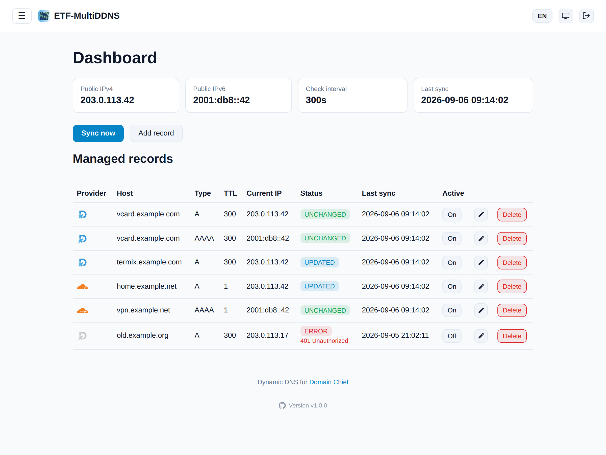

**English** | [Deutsch](LIESMICH.md)

<p align="center">
  
</p>

# ETF-MultiDDNS

A small Docker container that automatically updates A/AAAA records at [Domain Chief](https://domain.chief.app)
and/or [Cloudflare](https://www.cloudflare.com/) to your current public IP address - similar to
[cloudflare-ddns](https://github.com/timothymiller/cloudflare-ddns), just for both providers at once
(each DNS record picks its own provider, so domains hosted at either one can be kept in sync side by side).

Includes:

- a background sync loop that checks your public IPv4/IPv6 address and automatically **creates**
  (if they don't exist yet) or **updates** (if the IP has changed) DNS records hosted at Domain Chief
  and/or Cloudflare
- a Web UI for creating, enabling/disabling and **deleting** records, and viewing status and logs
- an optional CLI (`docker exec`) for managing via script/SSH



## Requirements

Only the provider(s) you actually plan to use need to be set up - Domain Chief and Cloudflare are both
optional and independent of each other.

### Domain Chief

- The affected domain(s) must use **Hosted DNS** at Domain Chief (i.e. Domain Chief's nameservers
  are active). Without Hosted DNS, the API can't manage records.
- A Domain Chief **Personal Access Token** (recommended for personal use) or a **Team Access Token**.

1. Personal Access Token: <https://domain.chief.app/api/token/create>
2. Required scopes: `domainchief:dns:read`, `domainchief:dns:write`, and `domainchief:domains:read`
   (the latter only so the Web UI can suggest a list of your domains when creating a record).
3. If your account has multiple teams and you don't want to use the default team: also set the team ID
   in the Web UI or via `DOMAINCHIEF_TEAM_ID`. Alternatively, use a **Team Access Token** (`ctt_...`)
   directly - that's automatically tied to a specific team.

### Cloudflare

- The affected domain(s) must exist as a **zone** in your Cloudflare account.
- A Cloudflare **API Token** (scoped, not the legacy Global API Key) with permissions
  `Zone:DNS:Edit` and `Zone:Zone:Read`, scoped to the zone(s)/domain(s) you want to manage.

1. Create one at <https://dash.cloudflare.com/profile/api-tokens> -> "Create Token" -> "Edit zone DNS"
   template (adjust the zone resource to the domain(s) you want to manage).
2. Enter it in the Web UI under **Settings -> Cloudflare**, or set it via `CLOUDFLARE_API_TOKEN`.
3. Optionally enable **"Proxied" (orange cloud)** per record when creating/editing it - routes the
   record through Cloudflare's proxy (performance/DDoS protection, hides the real IP) instead of
   pointing directly at the public IP ("DNS only", grey cloud).

## Start with Docker Compose (pre-built image)

```bash
cp .env.example .env   # optional, the token can also be set in the Web UI
# adjust the image name once in docker-compose.yml (username lowercased!),
# then:
docker compose up -d
```

The Web UI is then reachable at `http://<host>:8080`. If no token was set via an environment variable,
you can enter it there under **Settings** - including a "Test connection" button for each provider.
It's optionally also reachable encrypted via `https://<host>:8443` once enabled under **Settings ->
HTTPS** (see below) - both ports work in parallel.

The configuration (tokens if set via the UI, team ID, records, status) lives in `./config/config.json`
and survives container restarts, since the folder is mounted as a volume.

## Start with plain `docker run` (pre-built image, no build needed)

```bash
docker run -d \
  --name etf-multiddns \
  --restart unless-stopped \
  -p 8080:8080 \
  -p 8443:8443 \
  -e DOMAINCHIEF_API_TOKEN=ctp_your_token \
  -e CLOUDFLARE_API_TOKEN=your_cloudflare_token \
  -e CHECK_INTERVAL=300 \
  -v $(pwd)/config:/config \
  ghcr.io/<your-github-name-lowercased>/etf-multiddns:latest
```

(Drop the `-p 8443:8443` line if you don't plan on enabling HTTPS and don't want the port exposed. Omit
whichever of the two `*_API_TOKEN` variables you don't need - both are optional and independent, see
"Requirements" above.)

## Managing records

### Via the Web UI

- **Dashboard** (`/`): shows the currently detected public IPv4/IPv6, the time of the last sync, and
  the status of each managed record (unchanged / created / updated / error), together with the provider
  it's synced to. A button lets you trigger an immediate sync without waiting for the interval. The
  "Add record" button leads to the create/edit form (no longer a separate menu item); in the record
  list, the pencil icon opens the same form in edit mode. The record list can be sorted by clicking any
  column header (Provider, Host, Type, TTL, Current IP, Status, Last sync, Active - click again to
  reverse the order) and filtered with the search box and dropdowns above it (host name, provider, type,
  status, active/inactive); filters stay in effect across the automatic refresh, sorting is left as you
  set it.
- **Add/edit record** (`/records/new` or `/records/<id>/edit`, a shared form): choose the DNS provider
  (Domain Chief or Cloudflare - each record picks its own, both can be used at the same time), then
  enter domain, subdomain (empty = root domain, e.g. just `example.com`), type (A/AAAA), TTL, comment,
  and - for Cloudflare records - whether it should be **proxied** (orange cloud). When creating: if a
  matching record already exists at the chosen provider, it is adopted on the next sync (not created
  twice). When editing, only the domain and subdomain are fixed (delete and recreate the record for
  that) - provider, type, TTL, comment, and proxied status can all be changed. If the provider or type
  is changed, the next sync automatically creates a new DNS record at the (new) provider and removes the
  old one at the provider it used to be at; plain TTL/comment/proxied changes are likewise only applied
  on the next sync.
- **Import existing records** (`/records/import`, linked from the "Domain Chief"/"Cloudflare" sections
  in Settings): scans every domain at the configured provider(s) for A/AAAA records that already point at
  the currently detected public IPv4/IPv6 but aren't managed here yet - useful when records were created
  directly at the provider (or by an older setup) rather than through this app. Matching records are
  listed with their host, TTL, current IP and comment for review; the ones you select are added to local
  management already marked as up to date (no DNS change happens at the provider - it already had the
  right content), so they immediately show status "unchanged" instead of waiting for the next sync.
  Records already managed here, or whose content doesn't currently match your public IP, aren't offered.
- **On/Off**: the button in the "Active" column disables/enables a record. Turning a record off
  deletes its DNS record at the provider (so the hostname stops resolving instead of quietly sticking
  around, unmanaged, at whatever IP it was last updated to), but keeps the entry - and its configuration
  - in this list. Turning it back on recreates the DNS record at the provider on the next sync (triggered
  immediately, not waiting for the check interval).
- **Delete**: the trash-can button in the record list deletes the record both from the local
  configuration and directly at its provider via the API.
- **Settings** (`/settings`): API tokens for both providers, team ID (Domain Chief), check interval,
  timezone, and date/time format (for displaying timestamps), as well as the Web UI credentials
  (username/password).
- **Logs** (`/logs`): the most recent log lines from the sync loop.

### Login, appearance & language

- **Login:** On the very first visit to the Web UI, an initial setup wizard (`/setup`) guides you
  through creating a username and password. After that, every visit is protected via `/login` (session
  cookie, valid for 30 days). The "Log out" button in the top right lets you log out at any time, and
  the credentials can be changed under **Settings**.
  Alternatively, the username/password can be fixed via the `WEBUI_USERNAME` / `WEBUI_PASSWORD`
  environment variables (see `.env.example` or `docker-compose.yml`) - in that case the setup wizard is
  skipped and the fields in Settings are disabled.
- **Appearance:** In the top right you can choose between Light, Dark, and System (follows the
  operating system setting). The choice is stored in the browser (`localStorage`) and only applies
  locally to this device/browser.
- **Language:** The interface is available in German and English, switchable via "DE"/"EN" in the top
  right (stored via cookie).
- **Menu:** Navigation (Dashboard, Add record, Settings, Logs) sits behind the burger icon (☰) in the
  top left and opens as an overlay over the content. The pin icon in the menu lets you pin it - it then
  stays permanently visible and the content shifts to the right accordingly. The pin state is stored in
  the browser (`localStorage`) and only applies locally to this device/browser.
- **Timezone & date/time format:** By default the container runs in UTC. Under **Settings** you can
  choose a real IANA timezone (e.g. `Europe/Vienna`) as well as the display format for timestamps -
  this affects the logs (`/logs`) and the timestamps shown on the dashboard (e.g. "Last sync"). Changes
  take effect immediately, without a container restart. Alternatively set it via the `TZ` environment
  variable (see `.env.example`) - in that case it takes precedence and the field in Settings is
  disabled.

### HTTPS / secure connection

By default the Web UI is only served over plain HTTP (port 8080). Under **Settings -> HTTPS** you can
additionally turn on an encrypted connection on port 8443 (both ports keep working side by side - HTTP
isn't disabled) - `https://<host>:8443`. Two certificate sources are available:

- **Self-signed (default once enabled):** generated automatically, no setup needed. Since it isn't
  issued by a trusted certificate authority, browsers will show a security warning the first time you
  open the HTTPS URL - that's expected and can be confirmed/added as an exception. Optionally, a
  hostname or IP (e.g. your own DDNS domain) can be entered in Settings, which is then used as the
  certificate's name (CN/SAN) instead of a generic `localhost` certificate. A "Regenerate certificate"
  button is available if you ever need a fresh one.
- **Custom certificate:** import your own certificate + private key (PEM format, unencrypted, e.g. one
  issued by Let's Encrypt or an internal/company CA) to avoid the browser warning entirely. Once
  uploaded, the certificate source switches to "Custom certificate" automatically; it can be removed
  again at any time (reverting to the self-signed one).

Both the certificate and private key are stored in `config/certs/` (on the same persistent volume as
`config/config.json`), and every change takes effect immediately - no container restart required. The
HTTPS port itself can be changed via the `PORT_HTTPS` environment variable (default `8443`) if it needs
to be mapped to something else.

### Two-factor authentication (2FA)

Under **Settings -> Two-factor authentication (2FA)** you can add a second login step (TOTP, RFC 6238)
on top of the username/password - off by default.

- **Enable:** click "Enable 2FA", scan the shown QR code with an authenticator app (e.g. Google
  Authenticator, Aegis, 1Password, ...) - or enter the displayed key manually - then confirm with the
  current 6-digit code. Afterwards, a correct username/password no longer logs you in directly; a valid
  code from the app is also required (`/login/2fa`), with a tolerance of one 30-second step to allow for
  clock drift.
- **Recovery codes:** enabling 2FA (and every time you regenerate them) generates 8 single-use recovery
  codes, shown exactly once - store them somewhere safe (e.g. a password manager or printout). Each one
  can be used instead of the authenticator code, both to log in and to confirm disabling 2FA, and is
  consumed (invalidated) after use. "Regenerate recovery codes" under Settings invalidates all previous
  ones and issues a fresh set.
- **Disable:** requires a valid code (authenticator or recovery) as confirmation, same as changing other
  security-relevant settings.

The TOTP secret and the (hashed) recovery codes are stored in `config/config.json`, alongside the
existing Web UI credentials.

### Via the CLI (e.g. if you don't want a Web UI)

```bash
docker exec -it etf-multiddns python -m app.cli list
docker exec -it etf-multiddns python -m app.cli add --domain example.com --name home --type A --ttl 300
docker exec -it etf-multiddns python -m app.cli add --domain example.org --name vpn --type A --provider cloudflare --proxied
docker exec -it etf-multiddns python -m app.cli remove <record-id>
docker exec -it etf-multiddns python -m app.cli sync
```

`--provider` defaults to `domainchief`; pass `--provider cloudflare` (optionally with `--proxied`) for a
Cloudflare-managed record.

## How it works

1. Every `CHECK_INTERVAL` seconds (default 300, minimum 60), the current public IPv4 (via
   `api.ipify.org`, with fallbacks) and/or IPv6 is determined - depending on whether A and/or AAAA
   records are configured.
2. For each active record, its configured provider (Domain Chief or Cloudflare) is checked to see
   whether a DNS record with a matching name + type already exists there. Each provider is only
   contacted for the records that actually use it - a missing/invalid token for one provider only
   affects its own records, not the other provider's.
   - **None exists:** the record is newly created via the provider's API (Domain Chief:
     `POST /domains/{domain}/dns/records`; Cloudflare: `POST /zones/{zone_id}/dns_records`).
   - **One exists, but with different content/TTL/comment/proxied status:** the record is updated
     (`PUT .../dns_records/{id}` at either provider).
   - **Everything already matches:** nothing happens (no unnecessary API call).
3. Rate limits (HTTP 429) from either API are respected (`Retry-After` header where available) and
   retried automatically with backoff.

## Security notes

- The Web UI is protected by login (see above, the setup wizard or `WEBUI_USERNAME` /
  `WEBUI_PASSWORD`). However, there is **no CSRF protection** and **no brute-force/rate-limit
  protection** for the login. It's still intended to primarily be reachable within your own (home)
  network - don't expose it unprotected directly to the internet. If external access is desired,
  put a reverse proxy with its own auth/SSO and rate limiting in front of it as well.
- HTTPS (see above) protects the connection itself (credentials/session cookie in transit) but doesn't
  replace a reverse proxy for internet-facing setups - the self-signed certificate in particular isn't
  trusted by browsers/clients out of the box. For anything beyond your own local network, prefer a
  reverse proxy with a certificate from a trusted CA (e.g. Let's Encrypt) in front of this container,
  or import that certificate directly under Settings -> HTTPS.
- The session cookie is signed with a key that is automatically generated on first start and
  permanently stored in `config/config.json` (`secret_key`). Anyone with write access to this file can
  forge valid sessions with it - the file should accordingly only be readable by the container itself.
- The password is not stored in plain text, but as a hash (`werkzeug.security`, scrypt). The same
  applies to 2FA recovery codes; the TOTP secret itself is stored as-is (it must be, to compute/verify
  codes), so `config/config.json` should be treated as sensitive either way.
- Both API tokens are stored locally in `config/config.json` when set via the Web UI. If a token is set
  via an environment variable instead (`DOMAINCHIEF_API_TOKEN` / `CLOUDFLARE_API_TOKEN`), that takes
  precedence and the corresponding field in the Web UI is disabled. The same applies analogously to the
  Web UI credentials and `WEBUI_USERNAME` / `WEBUI_PASSWORD`.

## Known limitations

- Neither the Domain Chief nor the Cloudflare API has a PATCH for records - an update replaces type,
  content, and TTL (and, for Cloudflare, name/proxied) entirely (both clients handle this correctly and
  automatically).
- Only A and AAAA records are actively managed by this tool as a "DDNS target". Both APIs support
  further types, which aren't needed here though.
- There is no test mode for either API - changes to real domains go live immediately. To experiment,
  Domain Chief offers free `.example` domains; Cloudflare lets you add a low-stakes test domain/zone.
- The bot/abuse protection in front of `domain.chief.app` blocks requests using the `requests`
  library's default User-Agent (`python-requests/x.y`) with a plain text response `Bad Request` (not
  JSON, doesn't come from the Domain Chief API itself). The client therefore deliberately sets a
  different User-Agent (`curl/8.4.0`), which is demonstrably let through.
- A Cloudflare API token must be scoped to the zone(s) it should manage (`Zone:DNS:Edit` +
  `Zone:Zone:Read`); a token without access to a given domain's zone will fail with a clear "no zone
  found" error rather than silently doing nothing.

## Sources

- [Domain Chief - developer documentation](https://docs.chief.tools/domainchief/developers/build-with-domain-chief)
- [Cloudflare DNS API reference](https://developers.cloudflare.com/api/operations/dns-records-for-a-zone-list-dns-records)
- [Domain Chief API reference (OpenAPI)](https://docs.chief.tools/api/domainchief)
- [Create a Personal Access Token](https://domain.chief.app/api/token/create)
- [Create a Cloudflare API Token](https://dash.cloudflare.com/profile/api-tokens)

---

An AI project, made by [EiTiFuzzi](https://github.com/EiTiFuzzi) with the help of [Claude](https://claude.com)
[](https://claude.com)
